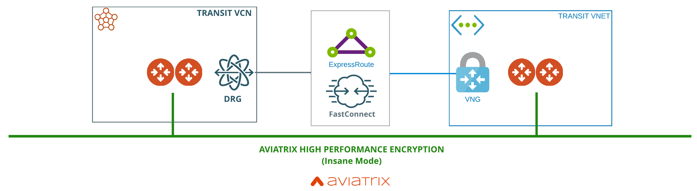
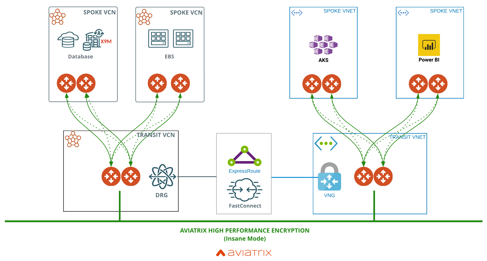
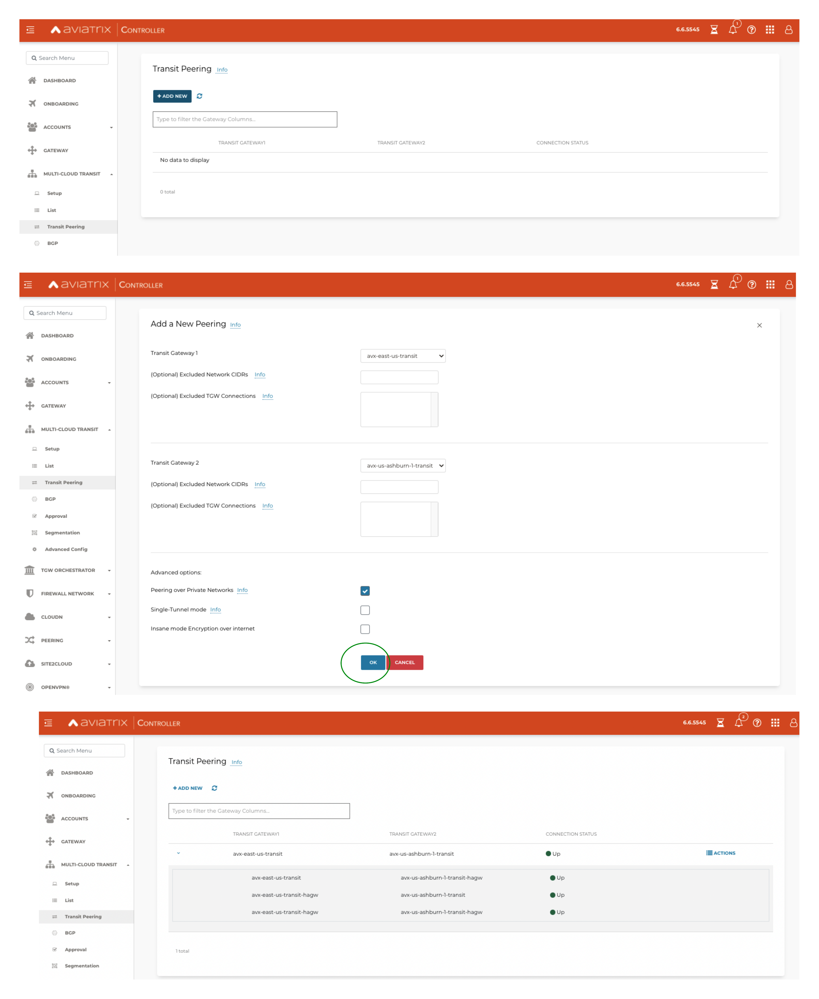
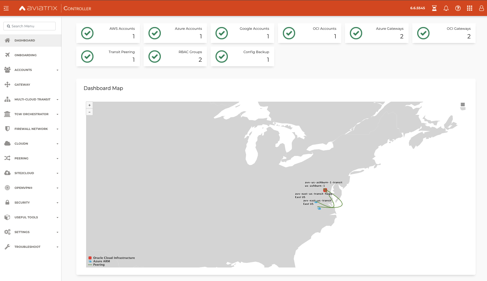

# Secure and Encrypt OCI Azure InterConnect
### Summary

This example provisions and configures Aviatrix High Performance Encryption between Oracle Cloud and Microsoft Azure.

### References

- [Microsoft](https://docs.microsoft.com/en-us/azure/virtual-machines/workloads/oracle/oracle-oci-overview#region-availability)

- [Oracle](https://www.oracle.com/cloud/azure-interconnect/)

- [ExpressRoute Peering Locations](https://docs.microsoft.com/en-us/azure/expressroute/expressroute-locations)

Everything in **Figure 1** is provisioned in OCI and Azure including a pair of Aviatrix Transit gateways in High Availability mode with High Performance Encryption in each region.



**Figure 1**

Interesting workloads to deploy with encryption..



### Compatibility
Terraform version | Controller version | Terraform provider version
:--- | :--- | :---
1.18 | 6.6.5545 | 2.21.2

### Modules

Module Name | Version | Description
:--- | :--- | :---
[terraform-aviatrix-modules/azure-transit/aviatrix](https://registry.terraform.io/modules/terraform-aviatrix-modules/azure-transit/aviatrix/latest) | 99.9 | This module deploys a VNET, Aviatrix transit gateways
[maxjahn/azure-interconnect/oci](https://registry.terraform.io/modules/terraform-aviatrix-modules/azure-spoke/aviatrix/latest) | 1.0.0 | Include an OCI-Azure interconnect in your project more easily by using this terraform module
[terraform-aviatrix-modules/oci-transit/aviatrix](https://registry.terraform.io/modules/terraform-aviatrix-modules/oci-transit/aviatrix/latest) | 99.9 | This module deploys a VCN, Aviatrix transit gateways 


### Workflow

- [Setup your environment](quick-start.md)
- ```terraform init```
- ```terraform plan```
- ```terraform apply --auto-approve``` **_Runtime approx 50m repeat apply as needed_**
- Add route rules in OCI and Azure **_Manual - 5m_**

- Create Aviatrix Transit peering over private network **_Manual - 5m_**


### Aviatrix Controller (post-provisioning)


### Terraform state (post-provisioning)

```
$ terraform state list
module.azure_transit_1.aviatrix_transit_gateway.default
module.azure_transit_1.aviatrix_vpc.default
module.interconnect.data.azurerm_public_ip.connect_vng_ip
module.interconnect.data.azurerm_resource_group.connect_rg
module.interconnect.data.azurerm_virtual_network.connect_vnet
module.interconnect.data.oci_core_fast_connect_provider_services.fcs
module.interconnect.data.oci_core_services.transit_services
module.interconnect.azurerm_express_route_circuit.connect_erc
module.interconnect.azurerm_public_ip.connect_vng_ip
module.interconnect.azurerm_subnet.gateway_subnet
module.interconnect.azurerm_virtual_network_gateway.conn_vng
module.interconnect.azurerm_virtual_network_gateway_connection.conn_vng_gw
module.interconnect.oci_core_drg.service_drg
module.interconnect.oci_core_drg_attachment.service_drg_attachment
module.interconnect.oci_core_route_table.interconnect_route_table
module.interconnect.oci_core_virtual_circuit.interconnect_virtual_circuit
module.oci_transit_1.aviatrix_transit_gateway.default
module.oci_transit_1.aviatrix_vpc.default
```

### Shout outs

Max Jahn's interconnect terraform module is fantastic!