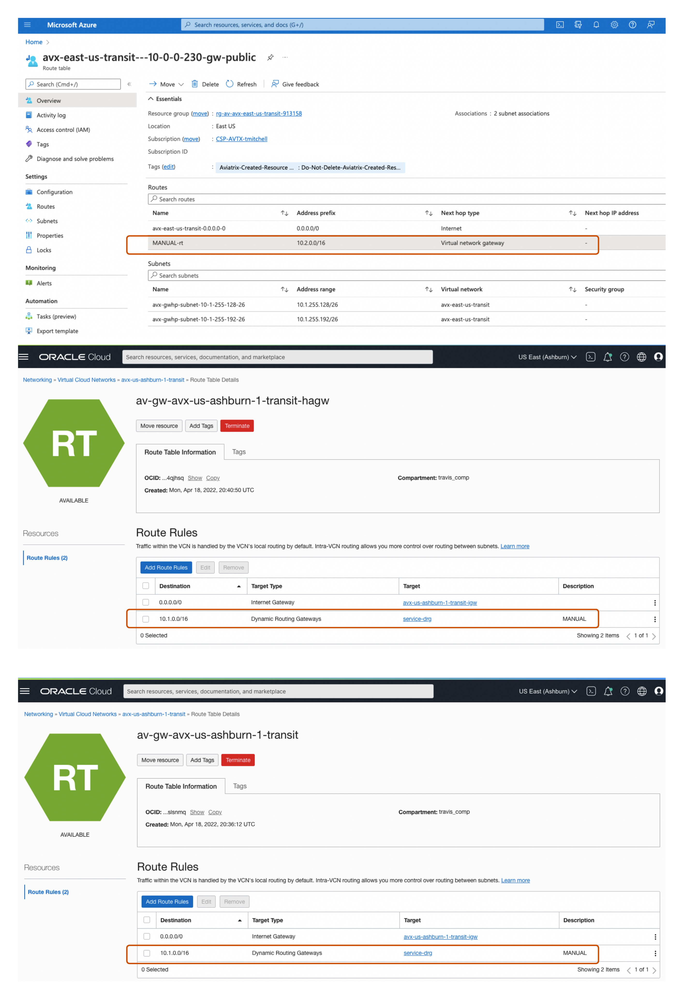

# Secure and Encrypt OCI Azure InterConnect
### Summary

This example provisions and configures Aviatrix High Performance Encryption between Oracle Cloud and Microsoft Azure including including the interconnect infrastructure in OCI and Azure in us-phoenix-1 and US West 3.

### References

- [Microsoft](https://docs.microsoft.com/en-us/azure/virtual-machines/workloads/oracle/oracle-oci-overview#region-availability)

- [Oracle](https://www.oracle.com/cloud/azure-interconnect/)

- [ExpressRoute Peering Locations](https://docs.microsoft.com/en-us/azure/expressroute/expressroute-locations)

Everything in **Figure 1** is provisioned in OCI and Azure including a pair of Aviatrix Transit gateways in High Availability mode with High Performance Encryption in each region and Spokes with test VMs attached to each.


**Figure 1 Basic Test Harness**


**Figure 2 Controller View Post-Provisioning**

Example Multicloud workloads to deploy with encryption..


### Compatibility
Terraform version | Controller version | Terraform provider version
:--- | :--- | :---
1.18 | 6.8.1148 | 2.23.0

### Modules

Module Name | Version | Description
:--- | :--- | :---
[terraform-aviatrix-modules/azure-transit/aviatrix](https://registry.terraform.io/modules/terraform-aviatrix-modules/mc-transit/aviatrix/latest) | 2.2.0 | Aviatrix Terraform module for transit deployment in multiple clouds
[maxjahn/azure-interconnect/oci](https://registry.terraform.io/modules/maxjahn/azure-interconnect/oci/latest) | 1.0.0 | Include an OCI-Azure interconnect in your project more easily by using this terraform module
[terraform-aviatrix-modules/oci-transit/aviatrix](https://registry.terraform.io/modules/terraform-aviatrix-modules/mc-spoke/aviatrix/latest) | 1.3.0 | Aviatrix Terraform module for spoke deployment in multiple clouds 


### Workflow

- [Setup your environment](quick-start.md)
- ```terraform init```
- ```terraform plan```
- ```terraform apply --auto-approve``` **_Runtime ~1h_**

#### Post Terraform Provisioning

**The Manual activity below is required because you cannot add route rules to an existing route table with OCI provider. Possible to code up purpose of this example is a simple repeatable test harness.**

- Add route rules in OCI and Azure **_Manual - 5m_**

- Create Aviatrix Transit peering over private network **_Manual - 5m_**


### Aviatrix Controller (post-provisioning)


### OCI Side of InterConnect


### Azure Side of InterConnect


### Terraform state (post-provisioning)

```
$ terraform state list
data.template_file.azure-init
module.azure_test_vm.data.azurerm_public_ip.vm[0]
module.azure_test_vm.data.azurerm_resource_group.vm
module.azure_test_vm.azurerm_availability_set.vm
module.azure_test_vm.azurerm_network_interface.vm[0]
module.azure_test_vm.azurerm_network_interface_security_group_association.test[0]
module.azure_test_vm.azurerm_network_security_group.vm
module.azure_test_vm.azurerm_network_security_rule.vm[0]
module.azure_test_vm.azurerm_public_ip.vm[0]
module.azure_test_vm.azurerm_virtual_machine.vm-linux[0]
module.azure_test_vm.random_id.vm-sa
module.azure_transit_1.aviatrix_transit_gateway.default
module.azure_transit_1.aviatrix_vpc.default
module.hpe_flex_vm.data.oci_identity_availability_domain.ad
module.hpe_flex_vm.oci_core_instance.flex_vm
module.interconnect.data.azurerm_public_ip.connect_vng_ip
module.interconnect.data.azurerm_resource_group.connect_rg
module.interconnect.data.azurerm_virtual_network.connect_vnet
module.interconnect.data.oci_core_fast_connect_provider_services.fcs
module.interconnect.data.oci_core_services.transit_services
module.interconnect.azurerm_express_route_circuit.connect_erc
module.interconnect.azurerm_public_ip.connect_vng_ip
module.interconnect.azurerm_subnet.gateway_subnet
module.interconnect.azurerm_virtual_network_gateway.conn_vng
module.interconnect.azurerm_virtual_network_gateway_connection.conn_vng_gw
module.interconnect.oci_core_drg.service_drg
module.interconnect.oci_core_drg_attachment.service_drg_attachment
module.interconnect.oci_core_route_table.interconnect_route_table
module.interconnect.oci_core_virtual_circuit.interconnect_virtual_circuit
module.oci_network_sec_group_hpe.oci_core_network_security_group.nsg
module.oci_network_sec_group_hpe.oci_core_network_security_group_security_rule.rule_egress_all
module.oci_network_sec_group_hpe.oci_core_network_security_group_security_rule.rule_ingress_all_icmp_type3_code4
module.oci_network_sec_group_hpe.oci_core_network_security_group_security_rule.rule_ingress_iperf5201
module.oci_network_sec_group_hpe.oci_core_network_security_group_security_rule.rule_ingress_ssh22
module.oci_network_sec_group_hpe.oci_core_network_security_group_security_rule.rule_ingress_vcn_icmp_type3
module.oci_transit_1.aviatrix_transit_gateway.default
module.oci_transit_1.aviatrix_vpc.default
module.spoke_azure_1.aviatrix_spoke_gateway.default
module.spoke_azure_1.aviatrix_spoke_transit_attachment.default[0]
module.spoke_azure_1.aviatrix_vpc.default[0]
module.spoke_oci_1.aviatrix_spoke_gateway.default
module.spoke_oci_1.aviatrix_spoke_transit_attachment.default[0]
module.spoke_oci_1.aviatrix_vpc.default[0]

```

### Shout outs

Max Jahn's interconnect terraform module is fantastic!
