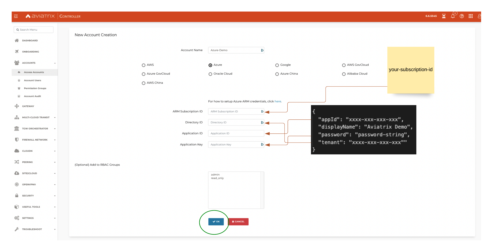
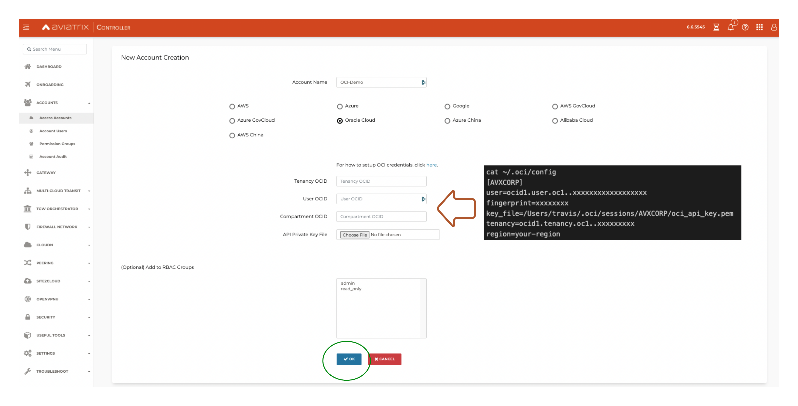

# Setup checklist

### Software

- Aviatrix Controller 6.8.1148 (Launch from CSP Marketplace)
- Terraform v1.1.8
- oci cli 3.7.2
- az cli 2.35.0

#### Install 
```
brew install oci-cli
brew install azure-cli
brew install terraform
```

#### Authenticate and setup (both will open your browser and setup keys)
```
oci setup bootstrap
az login
```

### Aviatrix Onboarding

### Azure

Using cli output, onboard accounts to Controller

az ad sp create-for-rbac --name "name you want to use here" --role="Contributor" --scopes=/subscriptions/xxxx-xx-xxxx-xxxx (replace Xs with subscription id)

```
az ad sp create-for-rbac --name "Aviatrix Demo" --role="Contributor" --scopes=/subscriptions/xxxxxx-xxxx-xxxx-xxxx

Output
```
{
  "appId": "xxxx-xxx-xxx-xxx",
  "displayName": "Aviatrix Demo",
  "password": "password-string",
  "tenant": "xxxx-xxx-xxx-xxx""
}
'''



### OCI
Collect the ocid for a compartment you have access to and use the cli output to onboard it.

```
cat ~/.oci/config
[AVXCORP]
user=ocid1.user.oc1..xxxxxxxxxxxxxxxxxx
fingerprint=xxxxxxxx
key_file=/Users/travis/.oci/sessions/AVXCORP/oci_api_key.pem
tenancy=ocid1.tenancy.oc1..xxxxxxxxx
region=your-region
```


### Terraform environment setup

#### Azure
Nothing required, provider uses ```az login``` setup earlier

#### OCI

Create a .env file and source it to set your Terraform environment variables for OCI

```
$ cat $HOME/cloud-dev/oci.env
#!/bin/bash
export TF_VAR_tenancy_ocid=ocid1.tenancy.oc1..xxxxxxx
export TF_VAR_user_ocid=ocid1.user.oc1..xxxxxxxx
export TF_VAR_fingerprint=xxxxxx
export TF_VAR_private_key_path=/Users/travis/.oci/sessions/AVXCORP/oci_api_key.pem
export TF_VAR_region=us-ashburn-1
export TF_VAR_compartment_ocid=ocid1.xxxxx
```

#### Aviatrix

Set these Terraform environment variables for Aviatrix

```
export TF_VAR_controller_ip      = 1.2.3.4 your controller IP
export TF_VAR_azure_account_name = "Azure-Demo" 
export TF_VAR_oci_account_name   = "OCI-Demo" 
```